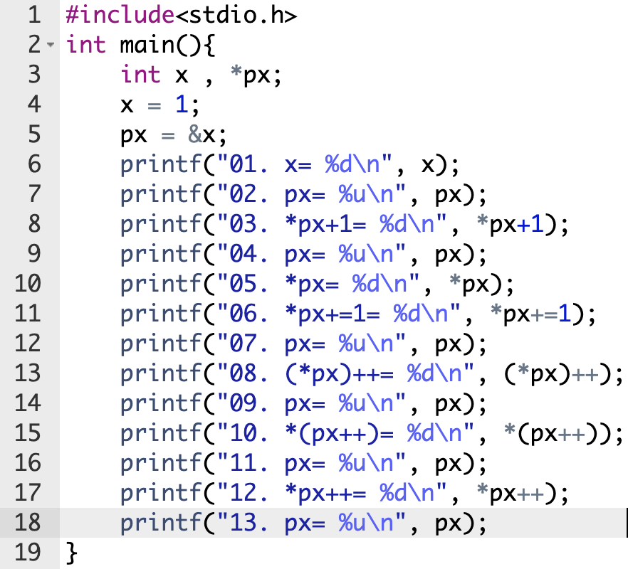

## 1. Descreva o que cada linha faz:

- Descreva o que cada linha faz:

<br>

**R:**

```c
#include <stdio.h>
```

Importa a biblioteca `stdio.h`, necessária para usar `printf()`.

```c
int main(){
```

Inicia a função principal do programa.

```c
int x, *px;
```

Declara:

* `x`: variável `int`.
* `px`: ponteiro para `int`.

```c
x = 1;
```

Define `x` como `1`.

```c
px = &x;
```

Faz `px` apontar para o endereço de `x`.

```c
printf("01. x= %d\n", x);
```

Imprime o valor de `x` → `1`.

```c
printf("02. px= %u\n", px);
```

Imprime o endereço de `px`.

```c
printf("03. *px+1= %d\n", *px+1);
```

Pega o valor apontado por `px` e soma `1`.

```text
*px = 1
*px + 1 = 2
```

Não altera `x`.

```c
printf("04. px= %u\n", px);
```

Imprime novamente o endereço armazenado em `px`.

```c
printf("05. *px= %d\n", *px);
```

Imprime o valor apontado por `px` → `1`.

```c
printf("06. *px+=1= %d\n", *px+=1);
```

Soma `1` ao valor apontado por `px`.

```c
*px += 1;
```

Como `px` aponta para `x`:

```text
x: 1 → 2
```

```c
printf("07. px= %u\n", px);
```

Imprime o endereço de `px`. O ponteiro continua apontando para `x`.

```c
printf("08. (*px)++= %d\n", (*px)++);
```

Incrementa o **valor** apontado por `px`.

```text
x: 2 → 3
```

Como é `++` pós-fixado, primeiro imprime `2` e depois incrementa para `3`.

```c
printf("09. px= %u\n", px);
```

Imprime o endereço de `px`. O endereço não mudou.

```c
printf("10. *(px++)= %d\n", *(px++));
```

Incrementa o **ponteiro**, não o valor.

* Usa o endereço atual de `px`.
* Depois `px++` faz o ponteiro avançar.

```c
printf("11. px= %u\n", px);
```

Mostra o novo endereço de `px`.

Agora `px` está apontando para a posição seguinte da memória.

```c
printf("12. *px++= %d\n", *px++);
```

Equivale a:

```c
*(px++)
```

Tenta acessar o valor para onde `px` aponta e depois incrementa o ponteiro.

Nesse ponto, `px` já saiu de `x`, então ocorre **comportamento indefinido**.

```c
printf("13. px= %u\n", px);
```

Imprime o endereço de `px`, mas o resultado já não é confiável devido ao comportamento indefinido anterior.

```c
}
```

Finaliza a função `main()`.

---

## importante

| Expressão  | O que altera                                         |
| ---------- | ---------------------------------------------------- |
| `*px`      | Acessa o **valor**                                   |
| `*px + 1`  | Soma 1, mas **não altera**                           |
| `*px += 1` | Altera o **valor**                                   |
| `(*px)++`  | Incrementa o **valor**                               |
| `px++`     | Incrementa o **ponteiro**                            |
| `*(px++)`  | Usa o valor atual e depois incrementa o **ponteiro** |

### Decore:

```c
(*px)++   // valor aumenta
px++      // ponteiro avança
```

## 2. Exercício Prático:

a. Crie um programa que leia 4 variáveis int, informe o endereço e o conteúdo de cada uma delas

b. Crie uma função que recebe quatro ponteiros para inteiros como parâmetros e devolva a media aritmética dos conteúdos apontados (float); (fazer a média dos números, não dos endereços)

c. Crie uma função que receba como parâmetro 3 ponteiros variáveis inteiras e devolva o maior valor (maior conteúdo, não o maior endereço);

d. Crie uma função que receba como parâmetro 3 ponteiros para inteiro e devolva o endereço que aponta para a variável de maior valor; (importante: quero o endereço do maior valor, não o maior endereço...)

[Atividade Prática](atividadePratica/)
